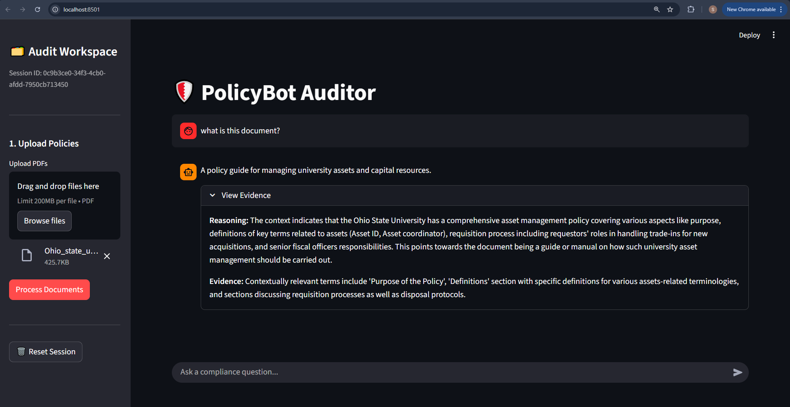
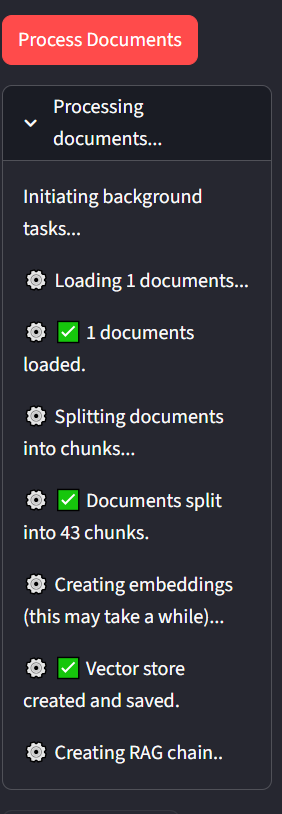
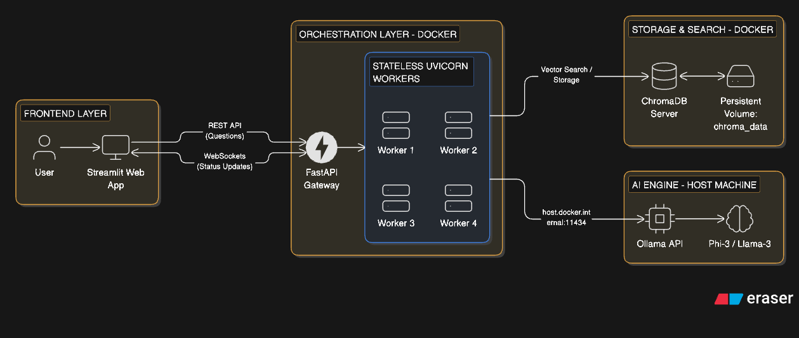

# 🛡️ PolicyBot Auditor

Automated GRC & Cybersecurity Policy Auditing using Retrieval-Augmented Generation (RAG).

PolicyBot Auditor is a production-ready GenAI tool designed to streamline auditing for frameworks like ISO 27001, SOC2, and HIPAA. By moving beyond simple Q&A, it acts as a Forensic Auditor, verifying compliance claims against uploaded evidence with high-fidelity citations.

# 🚀 Key Features

** 📄 Forensic RAG Pipeline: Unlike generic bots, this system is tethered strictly to the provided context, requiring exact citations and section references for every claim.

** ⚡ Real-Time Progress Tracking: Leverages WebSockets to provide live feedback on parsing, chunking, and vector indexing.

** 🧠 Stateless Microservice Architecture: Engineered with isolated worker processes (Uvicorn) that do not hold local state, allowing for seamless horizontal scaling.

** 🛡️ Multi-Tenant Isolation: Uses ChromaDB Collections to create "Secure Sandboxes" per client_id, ensuring zero data leakage between different audit sessions.

** 🔍 Structured Compliance Mapping: Generates programmatically verifiable JSON findings (Yes/No/Partial) with reasoning and exact quotes.

** 🔒 Privacy-First LLM: Optimized for air-gapped or private environments using Ollama (Phi-3, Llama3) on the host machine.

# 🏗️ Architecture

The system has evolved from a local script into a distributed Microservice Architecture:

API Layer: FastAPI running multiple stateless worker processes.

Database Layer: A central ChromaDB Server acting as the "Shared Brain" for all workers.

Orchestration: Docker Compose manages the networking between the API, the Vector DB, and the Host machine.

Security: Non-root container execution with explicit permission management for persistent volumes.

# 🛠️ Tech Stack

Backend: FastAPI (Python 3.11)

AI Orchestration: LangChain

Vector Database: ChromaDB (Client-Server Mode)

Embeddings: HuggingFace (all-MiniLM-L6-v2)

Inference: Ollama (External Host)

Deployment: Docker & Docker Compose

⚡ Quick Start (Dockerized)

# Prerequisites

Ollama installed on your host machine.

Model pulled: ollama pull phi3:instruct.

Docker & Docker Compose installed.

1. Configure Ollama for Docker

Ensure Ollama can receive traffic from the Docker bridge:

Mac/Linux: launchctl setenv OLLAMA_HOST "0.0.0.0"

Windows: Set environment variable OLLAMA_HOST to 0.0.0.0.

2. Launch the System

docker-compose up --build -d

API: http://localhost:8000

ChromaDB: http://localhost:8001

Swagger Docs: http://localhost:8000/docs

# 🔌 API Documentation

1. WebSocket (Progress)

Endpoint: ws://localhost:8000/ws/progress/{client_id}

Connect here first to monitor the ingestion heartbeat.

2. Ingest Documents

Endpoint: POST /upload-evidences/{client_id}

Payload: multipart/form-data

Action: Triggers the pipeline to parse and index documents into the central ChromaDB.

3. Forensic Query

Endpoint: POST /ask-question/{client_id}

Input: {"question": "Is encryption enforced for mobile devices?"}

Response: Structured JSON with answer, reasoning, and evidence (quote).

4. Cleanup & Wipe

Endpoint: DELETE /cleanup_client/{client_id}

Action: Drops the Chroma collection and wipes the persistent volume storage for that ID.

# 📁 Project Structure

├── docker-compose.yml   # Multi-service orchestration
├── backend/
│   ├── main.py          # FastAPI entry point (Stateless Routes)
│   ├── misc/
│   │   ├── rag_pipeline.py # Core ChromaDB & LangChain logic
│   │   ├── schemas.py      # Pydantic V2 data models
│   │   └── utils.py        # WebSocket & Connection helpers
│   ├── requirements.txt # Pinned production dependencies
│   └── Dockerfile       # Multi-stage secure build
└── chroma_data/         # Persistent Vector Storage (Volume)

# 📜 License

Distributed under the MIT License. Developed for automated Cybersecurity Policy Auditing.